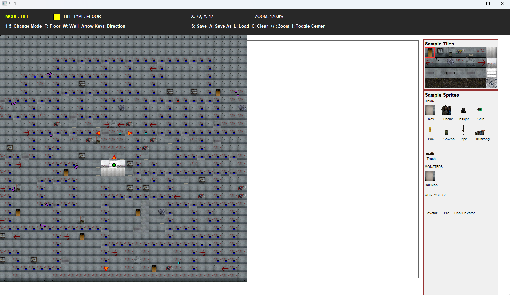

## 개요
* 타계는 [다른 세계에 가는 방법](https://namu.wiki/w/%EB%8B%A4%EB%A5%B8%20%EC%84%B8%EA%B3%84%EC%97%90%20%EA%B0%80%EB%8A%94%20%EB%B0%A9%EB%B2%95#toc)이란 괴담을 게임으로 표현한 프로젝트입니다.
* [Dark Deception](https://store.steampowered.com/app/332950/Dark_Deception/)을 벤치마킹하여 제작하였습니다. 주인공은 미로와 같은 공간을 돌아다니며 추격해오는 몬스터들을 피해 아이템들을 모아 스테이지를 탈출해야 합니다.
* 주로 [GitHub Project](https://github.com/orgs/PotenUpRunBetterRun/projects/1/views/2)를 통해 협업 하였습니다.
* 개발기간은 2025.4.12 ~ 2025.4.25, 약 2주 소요되었습니다.
    

### 플레이

### 사용 기술
* C++
* SDL 2.32.4
* SDL Mixer 2.8.1
      
### 제작자
|||||
|:--:|:--:|:--:|:--:|
|[Bohyeong Lee](https://github.com/leebo155)|[SEO HUIYEONG](https://github.com/shng6815)|[Hasimu](https://github.com/kofeeel)|[Baekbanjang](https://github.com/Baekbanjang)|
|PD, 게임아트|UI/UX, 사운드, 카메라|에디터, 데이터 관리|Scene, 추적 알고리즘|  

### 담당 업무
* **커스텀 TileMapEditor** - 인게임 에디터 제작
* **바이너리 파일 시그니처 기반 데이터 직렬화** - 파일 무결성 검증 및 효율적인 리소스 관리 시스템 개발
* **맵 매니저 구현** - 런타임에서 맵 정보를 관리하는 매니저
* **데이터 매니저 구현** - 모든 인게임 데이터의 저장/로드 기능을 담당하는 매니저
* **레벨 디자인** 
  
### 에디터 개발

#### 레퍼런스 에디터 

#### 구현한 에디터

#### 에디터 기능 
* 오브젝트(엔티티) 타입 별로 모드를 구분해서 다른 타입의 오브젝트는 삭제할 수 없도록 함
* 숏컷 기능: 저장(s), 로드(l), 다른 이름으로 저장(a), 맵 초기화(c), 드래그(우클릭 배치, 좌클릭 삭제), 확대/축소(마우스 휠), 스크롤(마우스 휠클릭)
* 샘플영역에서 배치할 타일, 오브젝트를 볼 수 있음
* 맵 저장시 가장자리는 항상 벽을 생성하게 함: Ray의 거리가 무한대가 되지 않고 충돌할 수 있게 예외처리
* 플레이어 시작위치의 타일은 항상 바닥 타입으로 설정하게 함 : Ray의 거리가 0이 되지않게 예외처리

### 프로젝트 회고록
https://kofeeel.tistory.com/62

### 영상

   

### 스크린샷

